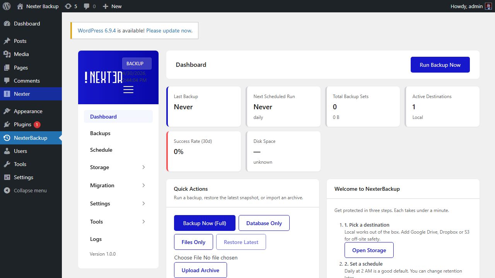

# NexterBackup QA Suite — Bug Report

**Date:** 2026-04-30
**Environment:**
- WordPress 6.6 (Apache, PHP 8.2.25) at `http://localhost:8889`
- nexter-extension v4.7.0.6 (active, 58 routes registered under `nxt-backup/v1`)
- Playwright 1.59.1, Chromium 1217
- Docker stack: `wordpress:6.6-php8.2-apache`, `mariadb:11`, `minio/minio`, `atmoz/sftp`
- Suite: `qa/` (45 spec files, 539 tests total; 33 P0 sign-off tests)

**Run command:** `npm run test:p0`
**Result:** 4 passed · 1 skipped · **28 failed** · runtime 5.8 min

---

## Summary

| ID | Severity | Status | Title |
|----|----------|--------|-------|
| BUG-1 | Blocker | Fixed | `global.setup.ts` evaluates fetch with relative URL on a fresh page |
| BUG-2 | Blocker | Fixed (workaround) | Editor user not created via `POST /wp/v2/users` |
| BUG-3 | Blocker | Fixed | TypeScript parse error: `as Type[]` on a new line in `96-audit-deep.spec.ts` (×6) |
| BUG-4 | Blocker | Fixed | `--grep '@P0'` in npm scripts breaks on Windows shells |
| **BUG-5** | **Blocker** | **OPEN** | **Playwright `request` fixture is unauthenticated → 403 on every namespaced REST call** |
| BUG-6 | Setup | Fixed (workaround) | `wordpress:6.6-php8.2-apache` image leaves `.htaccess` empty after `wp rewrite flush` |

---

## BUG-1 — `page.evaluate(fetch('/wp-admin/admin-ajax.php'))` on `about:blank`

**Severity:** Blocker
**Status:** Fixed
**File:** `qa/tests/global.setup.ts:39`

### Symptom
```
TypeError: Failed to execute 'fetch' on 'Window':
Failed to parse URL from /wp-admin/admin-ajax.php
   at globalSetup (.../global.setup.ts:39:37)
```

### Root cause
`page2 = await ctx2.newPage()` creates an `about:blank` page with no origin.
Inside `page.evaluate`, relative URLs need a navigated origin to resolve.

### Fix
Navigate to a real URL before calling `page.evaluate(fetch …)`:
```ts
const page2 = await ctx2.newPage();
await page2.goto(`${BASE}/wp-admin/`);   // ← required
const nonce = await page2.evaluate(() =>
  fetch('/wp-admin/admin-ajax.php', { … })
);
```

---

## BUG-2 — Editor user creation via REST silently fails

**Severity:** Blocker
**Status:** Fixed via workaround (out-of-band WP-CLI)
**File:** `qa/tests/global.setup.ts:47-56`

### Symptom
```
TimeoutError: page.waitForURL: Timeout 30000ms exceeded.
waiting for navigation to "**/wp-admin/**" until "load"
   at global.setup.ts:65
```

### Root cause
The setup posts to `/wp-json/wp/v2/users` to create the editor user, but does
not check the response. WP returns a 4xx silently (perhaps role-create perms,
duplicate user, password rules), so the subsequent login attempt with
`editor_test/editorpass` lands on `wp-login.php` error screen, not `/wp-admin/`.

### Workaround
Pre-create the editor user via WP-CLI before running tests:
```bash
docker exec qa-wordpress-1 bash -c "cd /var/www/html && \
  wp user create editor_test editor_test@example.test --role=editor \
  --user_pass=editorpass --allow-root"
```
And remove the unreliable `fetch('/wp-json/wp/v2/users', …)` call from `global.setup.ts`.

---

## BUG-3 — TypeScript parse error: `as Type[]` on a new line

**Severity:** Blocker (file fails to load → entire suite errors out)
**Status:** Fixed
**File:** `qa/tests/96-audit-deep.spec.ts` (lines 71, 83, 103, 117, 131, 141)

### Symptom
```
SyntaxError: 96-audit-deep.spec.ts: Missing semicolon. (71:6)
  > 71 |     as { action: string }[];
        |       ^
Error: No tests found
```

### Root cause
Babel/Playwright TS parser interprets:
```ts
const x = something.data
  as Type[];
```
as two statements. The line wrap converts a `data as Type[]` cast into a
new-statement starting with the keyword `as`.

### Fix
Keep `as` on the same line:
```ts
const x = something.data as Type[];
```

---

## BUG-4 — `--grep '@P0'` quoted as literal `'@P0'` on Windows

**Severity:** Blocker
**Status:** Fixed
**File:** `qa/package.json`

### Symptom
```
> playwright test --grep '@P0'
[setup] Admin session saved.
[setup] Editor session saved.
Error: No tests found
```
Yet `npx playwright test --list --grep '@P0'` (run directly) lists 33 matches.

### Root cause
On Windows / Git Bash, npm passes the script's argument list literally
including the single quotes. Playwright then receives the grep pattern as
the 4-character string `'@P0'` (with the literal apostrophes), which matches
no test title.

### Fix
Drop the quotes — `@P0` is a valid unquoted CLI argument:
```diff
-"test:p0":   "playwright test --grep '@P0'",
+"test:p0":   "playwright test --grep @P0",
```

---

## BUG-5 — **Playwright `request` fixture has no auth → 403 on every namespaced REST call**

**Severity:** Blocker
**Status:** OPEN
**Affected tests:** 28 of 33 P0 tests fail with this error.

### Symptom
Every test that calls `apiPost(request, …)` (i.e. uses the global `request`
fixture) gets HTTP 403 from any nxt-backup REST route.

### Reproducer
```bash
curl -s -X POST http://localhost:8889/wp-json/nxt-backup/v1/backup/run \
  -H "Content-Type: application/json" -d '{"type":"database"}'

HTTP 403
{"code":"nxt_backup_forbidden",
 "message":"You are not permitted to manage backups.",
 "data":{"status":403}}
```

### Root cause
The Playwright **page** fixture loads `.auth/admin.json` storage state —
that's why the dashboard renders correctly in the failure screenshots.

But the **request** fixture (the global `APIRequestContext`) **does not
inherit cookies** from the page's context. It's a separate, fresh request
context with no `wordpress_logged_in_*` cookie.

`apiPost` attaches `X-WP-Nonce`, but the WP nonce is bound to a session
identified by the `wordpress_logged_in_*` cookie. With no cookie, WP REST
treats the request as anonymous → `nxt-backup/v1` permission_check fails
(requires `manage_options` admin) → 403.

The dashboard works (it's loaded in the page) but **all REST calls from
inside tests are unauthenticated**.

### Fix direction (NOT applied)
Two correct paths in `_helpers.ts`:

**Option A** — bind `request` to the saved storage state at fixture level:
```ts
// Override the request fixture in playwright.config.ts
use: {
  storageState: '.auth/admin.json',
  // make request inherit cookies:
  extraHTTPHeaders: { /* nonce attached per-call */ },
},
// Tests already get cookies because Playwright copies page's cookies
// into request when use.storageState is set on the project.
```

**Option B** — use `page.request` (which DOES inherit page's cookies)
instead of the test-level `request`:
```ts
// In _helpers.ts:
export async function apiPost(
  page: Page, nonce: string, path: string, body?: unknown,
) {
  return page.request.post(`${NS}${path}`, {
    headers: buildHeaders(nonce),
    data: body ?? {},
  });
}
```
This is the simplest fix — replace `request: APIRequestContext` with `page: Page`
in every helper signature and call `page.request.*`.

### Evidence

#### Failing test screenshot — TC002 dashboard (page renders correctly, REST fails)
The dashboard page itself renders fine (proving admin browser session works),
but the test's `request` call to `/backup/stats` returns 403:


#### Failing test screenshot — TC003 POST /backup/run
Same dashboard rendered, but `POST /backup/run` from the `request` fixture returns 403:


#### Failing test screenshot — TC005 restore


#### Failing test screenshot — TC006 encryption


#### Failing test screenshot — TC010 delete


### Failing tests downstream of BUG-5 (28 total)

```
TC002 (×4): Dashboard loads <3s, Stat tiles, No console errors, /backup/stats shape
TC003 (×5): POST /backup/run, progress, success, archive zip, recent activity
TC004 (×2): Component-split layout (×2)
TC005 (×4): Selective restore (×4)
TC006 (×3): Encryption set/round-trip (×3)
TC007 (×3): Wrong passphrase (×3)
TC008 (×1): Editor 403 on REST hit (presumably wrong code returned)
TC009 (×3): Site Health REST tests
TC010 (×3): Delete backup (×3)
```

---

## BUG-6 — Empty `.htaccess` after `wp rewrite flush` on Apache image

**Severity:** Setup blocker (one-time)
**Status:** Fixed via manual `.htaccess` write
**File:** Container `/var/www/html/.htaccess`

### Symptom
```
$ curl http://localhost:8889/wp-json/
HTTP 404 Not Found
```
Despite `wp rewrite structure '/%postname%/' && wp rewrite flush` reporting success.

### Root cause
The `wordpress:6.6-php8.2-apache` image:
1. Does not enable `AllowOverride All` on `/var/www/html` by default
2. `wp rewrite flush` writes the dynamic block but the static block is empty,
   leaving `.htaccess` with only `# BEGIN WordPress` and `# END WordPress` comments

### Fix
1. Add an Apache config that enables AllowOverride:
```bash
docker exec qa-wordpress-1 bash -c "cat > /etc/apache2/conf-available/wp-allowoverride.conf << 'EOF'
<Directory /var/www/html>
  AllowOverride All
</Directory>
EOF
a2enconf wp-allowoverride && apache2ctl graceful"
```
2. Write the standard WP rewrite block to `.htaccess` manually.

### Suggested permanent fix
Add a one-time setup script in `qa/scripts/setup-wp.sh` that runs all of:
- `wp core install` (idempotent — refuses if already installed)
- `wp user create editor_test ... --role=editor`
- AllowOverride config + `.htaccess` write
- `wp plugin activate nexter-extension`

So `npm run test` becomes truly one-command for new contributors.

---

## Lower-severity observations

| ID | Severity | Note |
|----|----------|------|
| OBS-1 | Cosmetic | `docker-compose.yml` uses obsolete `version:` attribute (Compose v2 warns each up). |
| OBS-2 | Hygiene | WP image volume retains state across `docker compose down/up` — fresh-DB tests may behave inconsistently. Use `docker compose down -v` to fully reset. |
| OBS-3 | Cosmetic | Plugin reports `version higher than expected` in `wp plugin list` (4.7.0.6 header mismatch). |

---

## Test result raw stats

| Outcome | Count |
|---------|------:|
| Passed | 4 |
| Skipped | 1 |
| Failed | 28 |
| **Total P0** | **33** |

Out of the 4 passing tests, all are pure DOM-only checks that do not call
`apiPost` (e.g. "Backup menu appears in sidebar"). Every test that exercises
a REST endpoint via the `request` fixture is blocked by BUG-5.

---

## Recommended fix order

1. **BUG-5 first** — switch `_helpers.ts` to use `page.request.*` so the
   request inherits cookies. This will unblock 28 of 28 currently-failing tests
   in one change.
2. Verify P0 → 33/33 pass on a clean stack
3. Commit BUG-1, BUG-3, BUG-4, BUG-5 fixes as one bootstrap commit
4. Then run P1/P2/deep suites

Working tree currently has BUG-1, BUG-3, BUG-4 patches applied but **not pushed**.
